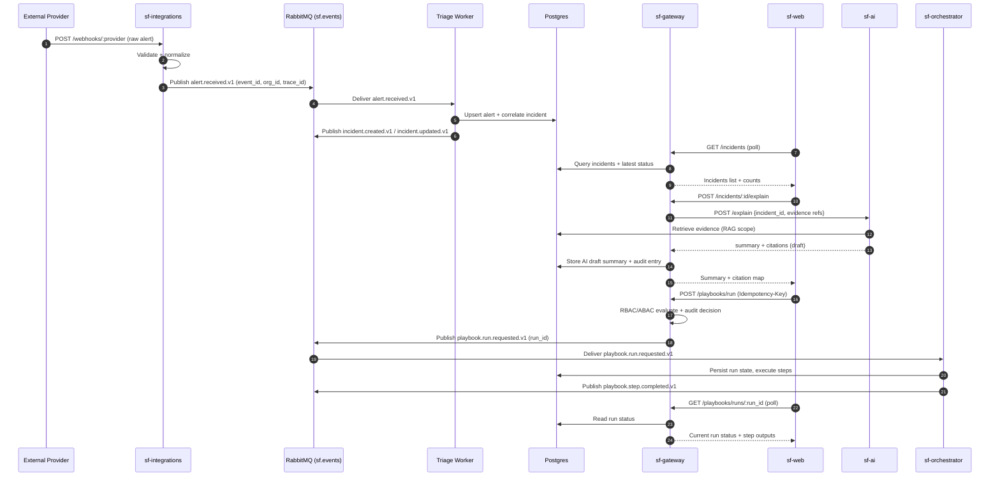

# SentinelForge System Design

This document explains the system design of SentinelForge with a focus on:

-   service boundaries and responsibilities
-   data ownership
-   event-driven flows (RabbitMQ)
-   reliability and failure handling
-   security enforcement
-   scaling considerations

This is written as a portfolio-grade **system design doc** (interview-friendly).

---

## 0) Visual System Diagram (Services & Flows)

### 0.1 High-level services map

```mermaid
flowchart LR
  U[User / Analyst] -->|Browser| WEB[sf-web\nNext.js App Router]

  WEB -->|HTTP API| GW[sf-gateway\nNestJS\nAuth + RBAC/ABAC + Audit]

  EXT[External Systems\nSIEM Mock / Webhooks] -->|HTTP Webhooks| INT[sf-integrations\nExpress\nValidate + Normalize]

  INT -->|Publish events| MQ[(RabbitMQ\nsf.events topic exchange)]

  MQ -->|alert.received.v1| TRIAGE[Incident Triage Worker\n(initially in Gateway or separate)]
  TRIAGE -->|DB write| PG[(Postgres)]
  TRIAGE -->|incident.created/updated| MQ

  GW -->|Read/Write domain data| PG
  GW -->|Cache/locks/rate limit (optional)| RD[(Redis)]

  GW -->|Request playbook run\n(playbook.run.requested.v1)| MQ
  MQ -->|playbook.run.requested.v1| ORCH[sf-orchestrator\nFastAPI\nPlaybook Executor]
  ORCH -->|Run state + outputs| PG
  ORCH -->|playbook.step.completed.v1| MQ

  GW -->|Explain request (HTTP)| AI[sf-ai\nFastAPI\nRAG + Mock LLM]
  AI -->|Read evidence / store drafts| PG
  AI -->|Optional consume events| MQ

  WEB <-->|Polling / Fetch| GW
```

---

### 0.2 “Happy path” (Webhook → Incident → AI → Playbook)



---

## 1) Problem Statement

Security teams receive a stream of alerts from many sources. They need:

-   a consistent way to ingest and normalize alerts
-   correlation into incidents
-   evidence organization and auditability
-   an explanation layer (AI-assisted triage) with citations
-   automated response via SOAR playbooks
-   strict access control (Zero-Trust) with traceable decisions

SentinelForge is a **local-first** demo platform that models these real-world requirements.

---

## 2) High-Level Architecture (C4-ish)

### Actors

-   Analyst / Admin / Viewer (humans via UI)
-   External systems (webhook providers / SIEM mock)

### Systems

-   **UI**: `sf-web` (Next.js)
-   **API Gateway + Security**: `sf-gateway` (NestJS)
-   **Integrations**: `sf-integrations` (Express)
-   **SOAR Executor**: `sf-orchestrator` (FastAPI)
-   **AI Service**: `sf-ai` (FastAPI)
-   **Messaging**: RabbitMQ
-   **Storage**: Postgres (+ optional pgvector), Redis (optional)

---

## 3) Service Responsibilities

### 3.1 `sf-web` (Next.js)

**Responsibilities**

-   present incidents, alerts, evidence, playbook runs, policies
-   show service health and system status
-   role-aware UI (but never trusted for authorization)

**Non-responsibilities**

-   no direct DB access
-   no direct RabbitMQ access
-   no auth logic beyond token/cookie handling and UI state

---

### 3.2 `sf-gateway` (NestJS)

**Responsibilities**

-   authentication (access + refresh rotation via HttpOnly cookies)
-   authorization: RBAC + ABAC enforcement (Policy Enforcement Point)
-   API for UI (incidents, evidence, playbooks, policies, audit)
-   audit logging + policy decision recording
-   potentially: incident read models and aggregation endpoints

**Non-responsibilities**

-   direct webhook ingestion (belongs to integrations)
-   running long playbook steps (belongs to orchestrator)

---

### 3.3 `sf-integrations` (Express)

**Responsibilities**

-   receive webhooks and normalize alerts
-   validate payloads and enforce size limits
-   publish normalized events (`alert.received.v1`) to RabbitMQ
-   optional: simple connectors (mock providers)

**Non-responsibilities**

-   no user auth
-   no incident/business logic

---

### 3.4 `sf-orchestrator` (FastAPI)

**Responsibilities**

-   execute playbooks as a state machine
-   retries, backoff, DLQ behavior for failed steps
-   idempotency for playbook run requests
-   publish step completion/failure events

**Non-responsibilities**

-   user-facing auth & policy management (gateway)
-   writing core incident data (unless explicitly owned)

---

### 3.5 `sf-ai` (FastAPI)

**Responsibilities**

-   retrieval of evidence/incident context (RAG)
-   deterministic **Mock LLM** summaries with citations
-   store AI outputs as draft + metadata for auditability
-   never perform actions with side effects automatically

**Non-responsibilities**

-   access control enforcement (gateway)
-   running playbooks (orchestrator)

---

## 4) Data Ownership & Storage

### Primary storage: Postgres

Suggested ownership model (simple and realistic for portfolio):

-   `sf-gateway` owns:
    -   users, orgs, roles
    -   incidents, alerts, evidence, audit logs, policy versions
-   `sf-orchestrator` owns:
    -   playbook definitions (optional) and playbook runs (state)
    -   step logs and outputs (or references)
-   `sf-ai` owns:
    -   AI summaries (drafts), citations, generation metadata
    -   retrieval index artifacts (if stored in DB)

**Rationale**

-   Keeps responsibilities clear.
-   Allows independent evolution of orchestrator and AI.
-   Avoids tight coupling via shared DB tables.

### Redis (optional)

Used for:

-   rate limiting counters
-   idempotency TTL cache (non-critical)
-   distributed locks (if needed later)

---

## 5) Event-Driven Design

### Exchange

-   `sf.events` topic exchange (durable)

### Event envelope (required)

-   `event_id`, `occurred_at`, `org_id`, `schema_version`, `trace_id`, `producer`

### Core event flow

1. `sf-integrations` publishes `alert.received.v1`
2. triage consumer correlates → creates incident
3. `incident.created.v1` / `incident.updated.v1` emitted
4. gateway UI shows incident state via API reads
5. user requests playbook → `playbook.run.requested.v1`
6. orchestrator runs steps → `playbook.step.completed.v1`
7. user requests AI explain → AI returns summary + citations (stored)

**Why events?**

-   aligns with real SecOps/SOAR ecosystems
-   demonstrates reliability patterns (idempotency, retries, DLQ)
-   prevents synchronous cascade failures

---

## 6) Key Flows (Sequence Descriptions)

### 6.1 Webhook → Alert → Incident

-   external sends webhook to `sf-integrations`
-   integrations validates and normalizes
-   publish `alert.received.v1`
-   consumer writes `alerts` row and runs correlator
-   correlator either:
    -   creates a new incident → emit `incident.created.v1`
    -   updates an existing incident → emit `incident.updated.v1`
-   UI polls gateway for updated incident list / details

### 6.2 Incident → Evidence → AI Explain

-   analyst adds evidence (note/link/log snippet)
-   gateway stores evidence and updates incident timeline
-   AI explain request triggers retrieval:
    -   gather relevant evidence
    -   generate deterministic summary + citations
    -   store AI draft summary + metadata
-   UI renders summary with clickable citations (evidence IDs)

### 6.3 Incident → Playbook Run

-   analyst requests playbook run from UI
-   gateway enforces RBAC/ABAC
-   gateway emits `playbook.run.requested.v1` with idempotency key
-   orchestrator runs step state machine
-   per step: persist status, retries, outputs
-   publish completion/failure events
-   gateway surfaces run state in UI

---

## 7) Reliability Design

### Reliability assumptions

-   at-least-once delivery for MQ
-   services can restart at any moment
-   dependencies can be slow/unavailable

### Mandatory mechanisms

-   idempotency via `event_id` and/or `Idempotency-Key`
-   retries with exponential backoff + jitter
-   DLQ for poison messages
-   timeouts for outbound HTTP calls
-   health vs readiness endpoints

See: `docs/reliability.md`

---

## 8) Security Design

### Auth

-   access token + refresh rotation in HttpOnly cookies

### Authorization

-   enforced in gateway using RBAC + ABAC policies
-   policy evaluation returns allow/deny + reason
-   decisions are logged/audited for sensitive actions

### Data boundaries

-   strict org scoping for all resources
-   no secrets in events
-   body size limits for webhooks

See: `docs/security.md` and `docs/policies.md`

---

## 9) Scalability & Performance Notes (Interview-friendly)

### Read paths

-   incidents list must be paginated and indexed
-   filters on severity/status/assignee should use indexes
-   avoid N+1 on incident details (batch load evidence/timeline)

### Write paths

-   webhook ingestion must be lightweight:
    -   validate → publish → ack quickly
-   heavy work (correlation, enrichment) should be async

### Messaging

-   consumer concurrency is bounded
-   backpressure handled by queue growth + alerts
-   DLQ prevents pipeline blockage

### AI

-   retrieval should be scoped to incident (not global)
-   caching of retrieval results possible (optional)
-   AI output stored as draft + citations

---

## 10) Operational Considerations (Local-first)

### Local-only constraints

-   no paid services
-   LLM is mocked
-   deployment deferred

### What must still look production-like

-   consistent env management
-   deterministic demo scenarios (seed + demo runner)
-   reproducible startup and reset
-   clear docs for flows and decisions

---

## 11) Future Enhancements (Optional)

-   websocket updates (replace polling)
-   OpenTelemetry traces (Jaeger)
-   policy simulation UI with diff
-   connector marketplace style integrations
-   signed events / schema registry
-   multi-tenant isolation hardening

---
